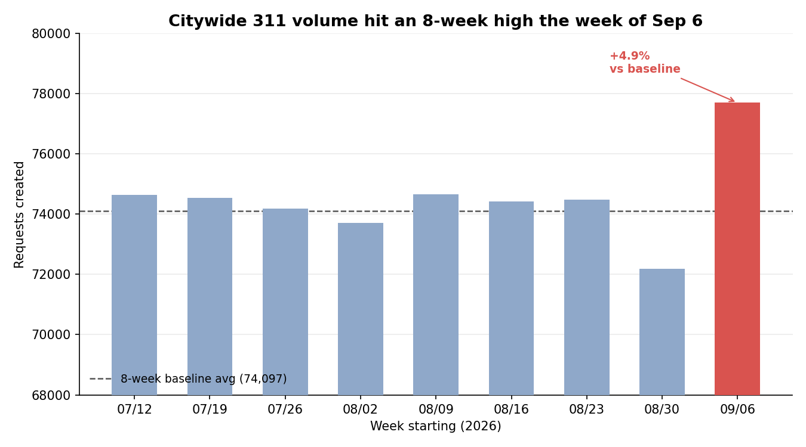
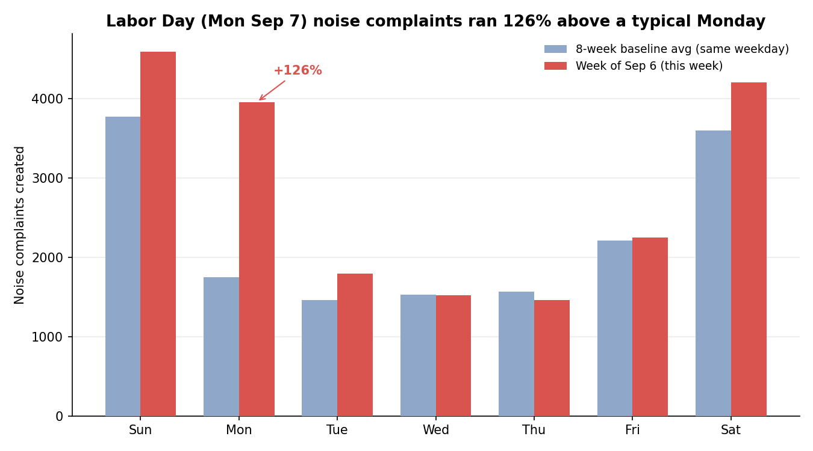
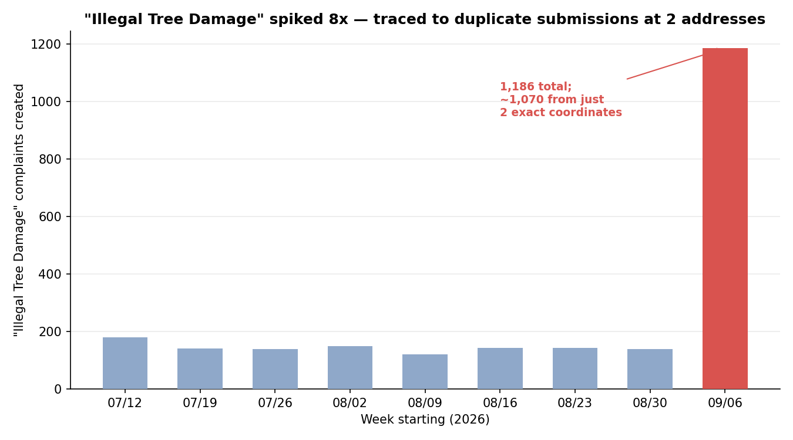

# Executive Summary
Time range covered: 2026-09-06T00:00:00 to 2026-09-13T00:00:00 (America/New_York)
Report generated: 2026-09-14 17:43 Asia/Jerusalem
Total requests analyzed: 77,696

- **Volume hit a multi-week high** — NYC 311 logged 77,696 requests this week, +4.9% above the 8-week baseline average (74,097) and above every one of the trailing 8 weeks (z ≈ 4.3). Saturday Sep 12 alone contributed over half of that excess (+1,856 requests, +19.1% vs. a typical Saturday); the rest of the week besides Monday ran moderately elevated too (roughly +1% to +7% per day). (Observation)
- **Noise is the top driver, but the Labor Day link is partial** — citywide noise complaints (all subtypes) ran +24.5% above baseline, an excess (+3,887) larger than the entire weekly total excess (+3,599). The noise surge itself was sharpest on Sunday, Monday (Labor Day), and Tuesday (+22%, +126%, +22% vs. each day's own baseline) and near-normal Wed–Fri, then elevated again Saturday (+17%). Notably, Labor Day Monday's *total* request volume actually ran *below* baseline (-7.0%) despite the huge noise spike — other agencies' request volume dropped enough on the holiday to offset it. (Observation / Hypothesis: the holiday plausibly explains the noise-specific timing, but does not explain the week's total-volume pattern, which is driven more by Saturday and a broad-based weekday lift — see Findings 1 and 2 for the decomposition)
- **A data-quality artifact inflated one category's count** — "Illegal Tree Damage" jumped from a ~143/week baseline to 1,186 this week (+729%). Investigation traced ~1,070 of those (90%) to just two exact geographic coordinates (one on the Upper West Side, Manhattan; one in Queens), submitted almost continuously online over 1–2 day bursts under a single descriptor ("Trunk Damaged"). This is very unlikely to reflect ~1,070 distinct real incidents and should be treated as duplicate/erroneous submissions rather than a genuine trend. It also adds roughly 1,000 requests (~30% of the week's total excess) to the headline volume figure that do not represent real-world events. (Observation, with a Conclusion about data quality — not a conclusion about actual tree damage)
- **Parking and driveway complaints rose too, but not on a holiday pattern** — Illegal Parking and Blocked Driveway both ran above baseline (+11.4% and +16.7% for the week overall), including on ordinary weekdays (Wed–Fri combined: Illegal Parking +24%, Blocked Driveway +33%), unlike noise's holiday-concentrated pattern. This is reported as a standalone Observation; a single specific citywide cause was not identified and should not be assumed to be the same Labor Day mechanism as noise. (Observation)
- **Borough patterns track the same mix shift, skewed in two boroughs by the data artifact** — Brooklyn's increase (+11.1%, +2,576 requests) is fully explained by the same noise/parking categories seen citywide. Manhattan's headline increase (+12.2%) is partly the tree-damage artifact (671 of those requests); with that removed, Manhattan's real increase is a more modest +7.4%. Queens looks flat at the borough level (-0.1%) only because its share of the tree-damage artifact (399 requests) is masking an underlying real decline of about -2.1%. (Observation)

---
# Detailed Findings

1. **Volume Trend**
   This week's 77,696 requests is the highest of the last 9 weeks and sits well outside the recent range (trailing 8-week baseline: 72,178–74,649; mean 74,097; std dev 833). The deviation (+4.9%, z ≈ 4.3) is large enough that random week-to-week noise is an unlikely full explanation. (Observation)

   

   Breaking the +3,599 weekly excess down by day (each day compared to its own 8-week baseline average for that weekday) shows it is not evenly spread: Saturday Sep 12 alone contributed +1,856 (52% of the total excess, +19.1% vs. a typical Saturday). Tuesday, Wednesday, Thursday, and Friday were each moderately elevated too (+3% to +7%). Sunday was close to normal (+1.3%), and — despite being the holiday — Monday's total volume actually ran *below* baseline (-7.0%). (Observation)

   | Day | This week | Baseline avg (same weekday) | Excess | % vs. baseline |
   |---|---:|---:|---:|---:|
   | Sun 09/06 | 10,467 | 10,335 | +132 | +1.3% |
   | Mon 09/07 (Labor Day) | 10,623 | 11,417 | -794 | -7.0% |
   | Tue 09/08 | 11,582 | 10,824 | +758 | +7.0% |
   | Wed 09/09 | 11,138 | 10,529 | +609 | +5.8% |
   | Thu 09/10 | 10,779 | 10,441 | +338 | +3.2% |
   | Fri 09/11 | 11,509 | 10,810 | +699 | +6.5% |
   | Sat 09/12 | 11,598 | 9,742 | +1,856 | +19.1% |

   Saturday's own complaint-type mix looks like a concentrated version of the rest of the week's drivers, not a new category: Illegal Parking (+22.4%), Noise – Residential (+15.5%), Noise – Street/Sidewalk (+10.7%), and Blocked Driveway (+13.4%) were all elevated that day, echoing Finding 2 and the Illegal Parking/Blocked Driveway observation below. (Observation)

   | Week starting | Total requests | vs. 8-wk baseline avg |
   |---|---:|---:|
   | 07/12 (baseline) | 74,629 | +0.7% |
   | 07/19 (baseline) | 74,539 | +0.6% |
   | 07/26 (baseline) | 74,176 | +0.1% |
   | 08/02 (baseline) | 73,718 | -0.5% |
   | 08/09 (baseline) | 74,649 | +0.7% |
   | 08/16 (baseline) | 74,416 | +0.4% |
   | 08/23 (baseline) | 74,473 | +0.5% |
   | 08/30 (baseline) | 72,178 | -2.6% |
   | **09/06 (reporting week)** | **77,696** | **+4.9%** |

2. **What's Driving the Excess: Noise (Holiday-Linked) and Parking (Broader, Unexplained)**
   Noise complaints (all "Noise - *" subtypes combined) totaled 19,759 this week vs. a baseline average of 15,873/week — an excess of +3,887 (+24.5%), which alone exceeds the total citywide excess of +3,599 (the rest of the mix netted slightly negative). Breaking noise volume out by day of week and comparing each day to its own 8-week baseline average (not to other days this week) isolates exactly where the surge sits: Sunday, Monday (Labor Day), and Tuesday all ran well above their own baselines (+22%, +126%, and +22% respectively), Wednesday–Friday were close to normal (-7% to +2%), and Saturday was elevated again (+17%). (Observation)

   

   Labor Day falling inside this reporting week (Sun Sep 6 – Sat Sep 12) is the most plausible mechanism for the noise-specific pattern: it converts a normally low-noise Monday into a holiday with weekend-like gathering and outdoor-activity patterns, and Tuesday's elevated count is consistent with overflow reporting the day after. This is a **Hypothesis**, not a confirmed cause — the dataset does not record *why* a complaint was filed, so the holiday explanation rests on the timing coincidence (the elevated days cluster tightly around the holiday and the weekend) rather than a mechanism directly observed in the data. Notably, this noise-specific surge did *not* translate into higher total volume on Labor Day itself — see Finding 1's day-of-week table, where Monday's all-category total actually ran -7.0% below baseline, implying other agencies' request volume fell enough on the holiday to more than offset the noise increase in that day's total.

   Illegal Parking (+11.4%, 13,040 vs. 11,710 baseline) and Blocked Driveway (+16.7%, 3,960 vs. 3,394 baseline) also ran above baseline for the week, but — unlike noise — not concentrated on the holiday: both were elevated broadly, including on ordinary Wednesday–Friday (combined Illegal Parking +24%, Blocked Driveway +33% vs. baseline for those three days alone). This rules out a clean "same Labor Day mechanism as noise" explanation for these two categories; they are reported here as a separate, moderate-confidence Observation without an identified single cause, rather than folded into the holiday Hypothesis above.

3. **Data-Quality Anomaly: "Illegal Tree Damage" Spike Is Not a Real Trend**
   "Illegal Tree Damage" (NYC Parks & Recreation) jumped from a stable ~119–178/week baseline to 1,186 this week — a 729% increase that is far larger and far more abrupt than any other category moved. On inspection, this is a duplicate-submission artifact, not a real surge in tree damage: (Observation → Conclusion, data quality)

   - 671 of the 1,186 records share one exact latitude/longitude (Upper West Side, Manhattan, ZIP 10024, Community Board 07), submitted almost continuously — day and night — between Sep 7 and Sep 9.
   - 399 more share a single different exact latitude/longitude (Queens), submitted continuously between Sep 11 and Sep 12.
   - Together these two coordinate points account for 1,070 of 1,186 records (90%); the remaining 116 are spread normally across 116+ distinct locations, in line with the historical baseline.
   - 1,097 of the 1,186 records (92%) share the identical descriptor "Trunk Damaged," and 1,121 of 1,186 (95%) came in through the ONLINE channel — a level of homogeneity not seen in any other high-volume category this week.

   

   It is very unlikely that 671 (or 399) genuinely distinct trunk-damage incidents occurred at the exact same coordinate within a 1–2 day window. The far more plausible explanation is a duplicate-submission event — a scripted/bulk submission, a portal retry bug, or repeated resubmission by a single reporter — rather than a real-world cluster of tree damage. (Conclusion, moderate-to-high confidence; mechanism unconfirmed — the dataset does not indicate *why* the duplicates occurred, only that they did)

   **Downstream impact:** this artifact adds roughly 1,000 requests to the citywide total that do not represent 1,000 distinct real-world events — about 30% of this week's total volume excess over baseline. The headline "record week" finding (#1 above) still holds even after excluding this artifact (77,696 − 1,070 ≈ 76,626 would still be a multi-week high, +3.4% above baseline), but readers using this category for operational purposes (e.g., Parks crew dispatch prioritization) should not act on the raw 1,186 count without first deduplicating by location and reporter.

## Geography
Borough totals broadly track the citywide noise/parking pattern, with the tree-damage artifact (Finding 3) distorting two boroughs' headline numbers:

| Borough | This week | 8-wk baseline avg | Raw vs. baseline | Tree-damage artifact in this week's count | Adjusted vs. baseline (ex-artifact) |
|---|---:|---:|---:|---:|---:|
| Brooklyn | 25,808 | 23,232 | +11.1% | 0 | +11.1% |
| Queens | 19,145 | 19,156 | -0.1% | 399 | -2.1% |
| Manhattan | 15,754 | 14,044 | +12.2% | 671 | +7.4% |
| Bronx | 14,108 | 14,613 | -3.5% | 0 | -3.5% |
| Staten Island | 2,812 | 2,959 | -5.0% | 0 | -5.0% |
| Unspecified | 69 | 93 | -25.8% | 0 | -25.8% |

Brooklyn's real increase is driven by the same categories as the citywide story: Illegal Parking (+17.7%), Noise – Street/Sidewalk (+60.6%), Noise – Residential (+26.5%), and Blocked Driveway (+40.9%) — the same noise (holiday-linked) and parking/driveway (broader, cause not identified) categories from Finding 2, not a Brooklyn-specific issue. (Observation)

## Caveats & Data Quality
- **Tree-damage duplicate cluster (Finding 3) is the most consequential data-quality issue this week** and should be treated as inflating both the "Illegal Tree Damage" category and, to a lesser extent, the Manhattan/Queens/citywide totals. It has not been removed from the headline 77,696 figure (per this report's fixed reporting convention of using the raw independently-computed count), only flagged and quantified.
- **End-of-window status skew**: requests created in the final 1–2 days of the week (Sep 11–12) are more likely to still show status "Open"/"In Progress" and lack a `closed_date`, since resolution takes time — this is expected and not itself an anomaly. Citywide this week: 52,942 Closed, 12,688 In Progress, 11,889 Open, 159 Assigned, 13 Pending, 5 Unspecified.
- **Geocoding gaps**: 69 requests (0.1%) had no borough on file and 1,238 (1.6%) had no latitude/longitude this week, in line with typical coverage; the Geography table's "Unspecified" row and any location-based cuts inherit this small gap.
- **Small-sample caveat**: several complaint-type and single-day figures cited above (e.g., daily noise counts, the two tree-damage coordinate clusters) are based on counts in the hundreds to low thousands — directionally solid but with more relative noise than the citywide weekly totals.
- **Backfill/correction risk**: Socrata's 311 dataset can receive retroactive corrections after initial publication; figures in this report reflect a single snapshot pulled 2026-09-14 and may shift slightly on a later pull of the same week.
- Validation: rigor-pass run (2 fixes addressed — corrected an inaccurate day-of-week noise claim, and replaced an overclaimed single-cause "Labor Day drove the spike" narrative with the verified day-level decomposition in Findings 1–2); independent verification of "the Illegal Tree Damage spike is a duplicate-submission data-quality artifact, not a real surge" → HOLDS.

## Data & Methodology
- Source: NYC 311 Service Requests (Socrata SODA API), `erm2-nwe9.json`, no auth.
- Reporting week: `created_date >= '2026-09-06T00:00:00' AND created_date < '2026-09-13T00:00:00'` → 77,696 total requests (independently confirmed against the figure supplied for this report).
- Baseline: 8 weeks strictly preceding the reporting week (2026-07-12 through 2026-09-06), queried and aggregated separately per week; the reporting week is never included in its own baseline.
- Key queries (all via `$select ... count(*) as cnt ... $group=...`):
  - Weekly totals (9 weeks): `$where=created_date >= '<week_start>' AND created_date < '<week_end>'`
  - Complaint-type mix: grouped by `complaint_type`, reporting week and each baseline week summed
  - Day-of-week noise: `$select=date_trunc_ymd(created_date) as day, count(*)`, filtered `complaint_type like 'Noise%'`, grouped by day, reporting week and each baseline week mapped to weekday
  - Tree-damage anomaly drill-down: grouped by `latitude, longitude` and by `descriptor`, `open_data_channel_type`, `borough`, `agency`, filtered to `complaint_type = 'Illegal Tree Damage'`
  - Borough mix: grouped by `borough`, reporting week and 8-week baseline sum
  - Status / channel / agency mix: grouped by `status`, `open_data_channel_type`, `agency_name`
- All comparisons use the 8-week trailing baseline mean (or per-weekday mean, for the day-of-week finding) computed from data strictly before 2026-09-06.