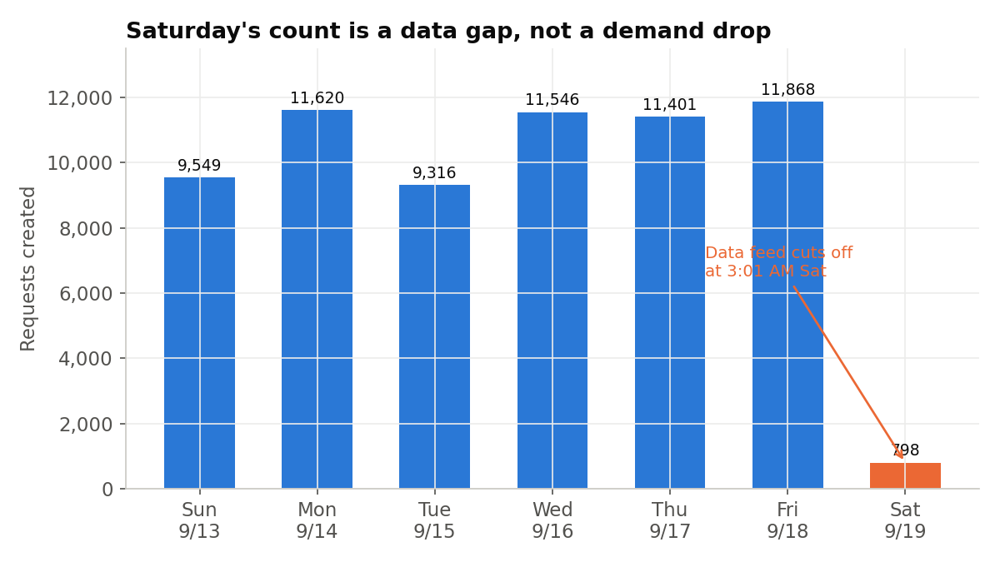
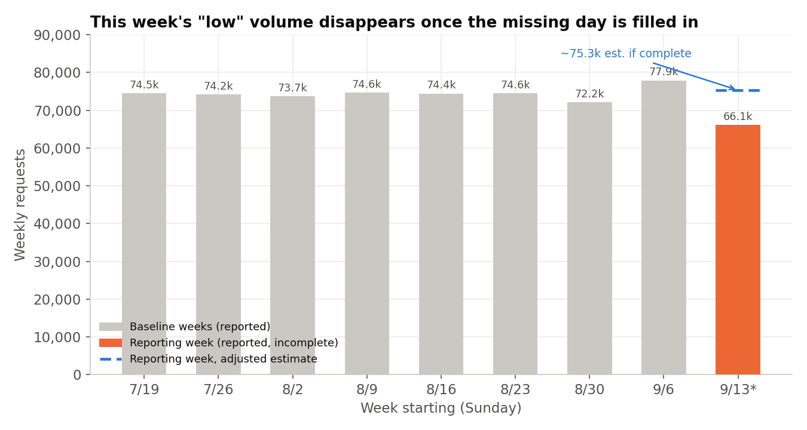
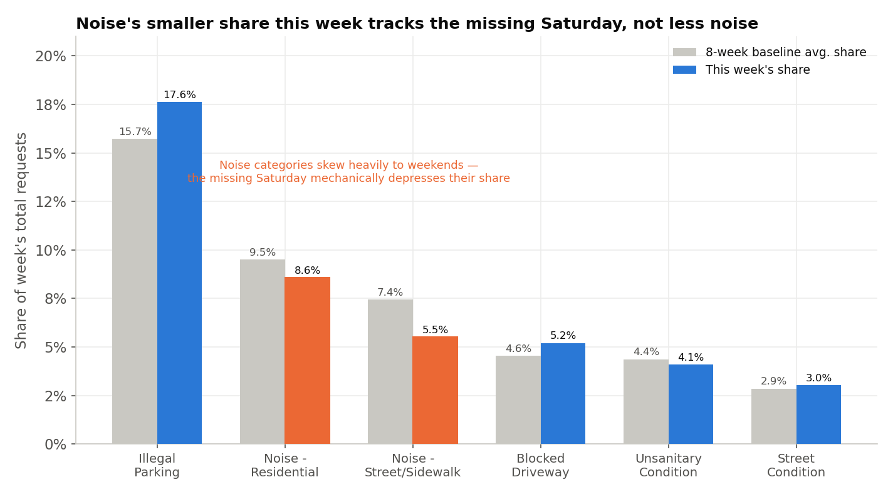

# Executive Summary
Time range covered: 2026-09-13T00:00:00 to 2026-09-20T00:00:00 (America/New_York)
Report generated: 2026-09-20 09:03 Asia/Jerusalem
Total requests analyzed: 66,098

- **Headline volume looks like an 8-week low, but it isn't real** — the raw total of 66,098 sits 11.3% below the 8-week baseline average (74,523/week, z ≈ -5.3), which would normally be the story of the week. Instead, the data feed for this reporting window degrades sharply overnight on the final day (Saturday 9/19) — normal through 1 AM, an empty hour at 2 AM (vs. a typical ~200), and just 1 more request before going silent at 03:00:59 — leaving only 798 of a typical ~10,000 Saturday requests captured. Filling that day back in with a typical Saturday brings the estimate to roughly 75,300 — right at baseline. (Observation → Conclusion: this week's true citywide volume looks normal; the shortfall is a data-pipeline lag, not a demand change.)
- **Category mix shifts mostly wash out once the missing day is accounted for** — Noise complaints' share of the week dropped visibly, but Noise is heavily weekend-skewed in the baseline (Saturday alone is ~23% of a typical week's noise volume), so losing Saturday mechanically depresses its share; a same-mechanism estimate for a Sunday–Friday-only week lands almost exactly on what was actually observed. (Hypothesis, well-supported → Conclusion: not a real drop in noise activity.)
- **One category doesn't fit the artifact story: Illegal Parking looks genuinely elevated, for a second week running** — unlike Noise, Illegal Parking's volume is nearly flat across days of the week in the baseline, so the missing Saturday can't explain its jump in share. It logged 11,642 requests in just six days — already close to a typical *full* 7-day baseline week (11,710) and ~15% above the typical six-day (Sun–Fri) pace — and the immediately preceding week was already the baseline's high point (13,040). The increase is broadly spread across boroughs rather than concentrated in one. (Observation → Hypothesis: a real, modest two-week uptick worth watching, not yet a confirmed trend.)
- **Geography is unremarkable** — borough shares of requests are all within about 1 percentage point of their 8-week baseline shares; no material geographic shift this week. (Observation)
- **Process note for future weeks** — this report was generated only a few hours after the reporting window closed, before the Socrata feed had caught up on the final day. Recommend either delaying the weekly pull by ~24 hours or explicitly flagging/estimating the most recent day going forward, since this lag pattern may recur.

---
# Detailed Findings

1. **Volume: An Apparent 8-Week Low That Isn't**

   Observation: This week's raw total is 66,098 requests, 11.3% below the trailing 8-week baseline mean of 74,523 (z ≈ -5.3 against a baseline standard deviation of ~1,601) — see chart below. Taken at face value, this would be the largest weekly swing in the 9-week window shown.

   Observation: Daily volume within the week runs 9,300–11,900 requests/day for Sunday through Friday (in line with typical levels — see Data & Methodology, and notably not declining into the weekend: Friday 9/18 was the week's second-highest day), then drops to 798 on Saturday 9/19. Hour-by-hour, that day looks normal through 1 AM (499 then 298 requests), goes to zero at 2 AM (vs. ~200 on a typical Saturday), and stops for good after one more request at 03:00:59 AM; nothing after that point has been ingested as of report generation (2026-09-20 09:03 Asia/Jerusalem ≈ 02:03 America/New_York, roughly two hours after the reporting window closed). This looks like a feed degrading and then stopping, not a real citywide drop-off, which would be spread more evenly across the day. A typical Saturday in the 8-week baseline runs 9,300–11,700 requests (mean ~10,037).

   | Metric | Value |
   |---|---|
   | Reported total (as measured) | 66,098 |
   | Sun–Fri actual (6 days) | 65,300 |
   | Missing-day actual (Sat, partial) | 798 |
   | Typical Saturday (8-wk baseline mean) | ~10,037 |
   | **Adjusted estimate** (Sun–Fri actual + typical Saturday) | **~75,337** |
   | 8-week baseline mean | 74,523 |
   | Adjusted estimate vs. baseline | **+1.1%** (z ≈ 0.5) |

   Conclusion: Once the incomplete final day is swapped for a typical Saturday, this week's estimated volume is well within normal range — indistinguishable from baseline noise. As an independent cross-check, this week's Sun–Fri total (65,300) is within 1.4% of the *prior* week's Sun–Fri total (66,255), which is also consistent with normal week-to-week variation. There is no evidence of a real citywide change in 311 demand this week; the apparent drop is a data-completeness artifact.

   

   

2. **Disentangling the Category Mix Shift: One Artifact, One Real Signal**

   Losing a day of data doesn't just shrink the total — it can distort category *mix*, because different complaint types have different day-of-week patterns. Two categories moved this week; decomposing them separately shows they have different, in fact opposite, explanations.

   **Noise — the drop is mechanical.** Combined Noise categories (Residential, Street/Sidewalk, Vehicle, Commercial, and unspecified "Noise") fell from a baseline share of 21.6% of weekly requests to 19.6% this week (12,946 requests, vs. a baseline weekly average of ~16,077). But in the 8-week baseline, Noise is sharply weekend-skewed: Saturday alone accounts for ~23% of a typical week's Noise volume (baseline Saturday Noise ≈3,731 requests/week vs. ≈1,500–2,150/weekday). Using each day's historical share of the baseline pattern, a week missing Saturday entirely would be *expected* to show a Noise share of about 19.1% from mix arithmetic alone — almost exactly the 19.6% observed. Hypothesis confirmed as Conclusion: the Noise dip is fully explained by the missing weekend day, not a change in noise complaint behavior.

   **Illegal Parking — the rise looks real.** Illegal Parking's share rose from a baseline 15.7% to 17.6% this week (11,642 requests). But Illegal Parking's baseline volume is nearly flat across the week (a low of 12,510 on Saturday vs. a high of 13,981 on Tuesday, in an 8-week sum — no weekend skew to speak of), so removing Saturday should barely move its share (mechanically expected ≈15.7%, same as baseline). Instead, Illegal Parking logged 11,642 requests in the six days with usable data this week: already close to a typical *full 7-day* baseline week (mean 11,710, sd ≈594 across the 8 baseline weeks) and about 15% above the typical six-day (Sun–Fri) pace of 10,146 from the same weeks. Adjusting for the missing Saturday the same way as Finding 1 (adding a typical Saturday's ~1,564 Illegal Parking requests) gives an estimated full week of ~13,206 — about 2.5 standard deviations above the 8-week baseline mean, and in the same elevated range as the *immediately preceding* week's actual count of 13,040 (≈2.2 sd above baseline). The six weeks before that ran 11,274–12,024, close to baseline. The increase also isn't concentrated in one borough: each borough's share of Illegal Parking this week is within 1–2 points of its typical share (Brooklyn 38.3%→39.4%, Queens 31.7%→29.3%, Bronx 15.2%→15.0%, Manhattan 12.2%→13.5%, Staten Island 2.7%→2.8%), which argues against a single localized driver (e.g., one precinct's enforcement sweep) in favor of a broader, if still modest, citywide pattern. Observation → Hypothesis: a real, modest increase in Illegal Parking complaint volume that is now two weeks old, not an artifact of the missing day. Caveat: two elevated weeks against an 8-week baseline is suggestive, not conclusive — worth confirming next week rather than treating as an established trend, and this analysis did not identify a specific mechanism (e.g., an enforcement policy change or seasonal effect) behind it.

   | Category | Baseline: avg weekly count (share) | This week: count (share) | Explained by missing Saturday? |
   |---|---|---|---|
   | Illegal Parking | 11,710/wk (15.7%) | 11,642 (17.6%) | No — mechanically flat; likely a real, modest increase |
   | Noise (all types) | 16,077/wk (21.6%) | 12,946 (19.6%) | Yes — fully explained by weekend skew |
   | Blocked Driveway | 3,394/wk (4.6%) | 3,441 (5.2%) | Not tested in depth; small movement |
   | Unsanitary Condition | 3,255/wk (4.4%) | 2,711 (4.1%) | Not tested in depth; small movement |
   | Street Condition | 2,132/wk (2.9%) | 2,013 (3.0%) | Not tested in depth; small movement |

   

## Geography

Borough shares of requests this week are close to their 8-week baseline shares, with no shift larger than about 1 percentage point: Brooklyn 32.3% (baseline 31.7%), Queens 24.8% (baseline 25.7%), Manhattan 20.2% (baseline 19.2%), Bronx 18.4% (baseline 19.4%), Staten Island 4.1% (baseline 4.0%). These are within the range of normal week-to-week movement and are not investigated further this week. (Observation: no material geographic finding.)

## Caveats & Data Quality

- **Primary caveat — data-pipeline lag, not a demand signal.** As detailed in Finding 1, the Socrata feed for this window is only complete through 03:00:59 AM on the final day (Saturday 9/19); everything after that has not yet been ingested as of report generation. This affects the raw total, the daily breakdown, and any category/geography split derived from it. All comparisons in this report account for this by using an adjusted estimate or a like-for-like (Sun–Fri) window where relevant — do not read the raw 66,098 figure as a real volume change.
- **Status/closure figures skew toward "Open"/"In Progress" for recent days.** 65.6% of this week's requests show status "Closed", 17.2% "In Progress", and 16.9% "Open" — but requests created in the last 1–2 days of any window haven't had time to be resolved, so this is a normal recency effect, not a service-backlog signal, and is compounded this week by the missing final day.
- **Backfill risk.** NYC Open Data's 311 dataset is known to receive retroactive corrections and late-arriving records after initial publication; figures in this report, especially for the most recent days, may shift slightly if re-pulled later.
- **Geocoding/attribution gaps are minor.** "Unspecified" borough accounts for 0.12% of this week's requests (79 of 66,098), in line with the 8-week baseline rate (0.11%) — not a new data-quality issue.
- **Illegal Parking finding rests on two weeks.** The Finding 2 read on Illegal Parking is based on two weeks compared to a moderately variable 8-week baseline (sd ≈594 on a mean of 11,710); it is flagged as a hypothesis to watch, not a confirmed trend, and no causal mechanism was identified.
- Validation: rigor-pass run against this draft (fixes applied: added raw volume alongside share in the category-mix table, disentangled the Illegal Parking rise by borough, and strengthened it with the second consecutive elevated week); independent verification of "the volume shortfall is a data-lag artifact, not a real demand drop" → HOLDS WITH CAVEAT (an independent agent, querying the API directly, reproduced every headline figure exactly but found the feed degrades in the 2 AM hour rather than stopping instantaneously at 03:00:59 — a timing refinement that does not change the conclusion; reflected in Finding 1 above).

## Data & Methodology

Source: NYC 311 Service Requests (Socrata `erm2-nwe9`), `$where`-filtered on `created_date`, no auth. All timestamps are naive America/New_York as stored, used as-is.

- Reporting-week total: `$where=created_date >= '2026-09-13T00:00:00' AND created_date < '2026-09-20T00:00:00'` → 66,098
- Reporting-week daily breakdown: same window, `$group=date_trunc_ymd(created_date)` → Sun 9,549 / Mon 11,620 / Tue 9,316 / Wed 11,546 / Thu 11,401 / Fri 11,868 / Sat 798
- Reporting-week hourly breakdown for Sat 9/19: `$group=date_extract_hh(created_date)` → hour 0: 499, hour 1: 298, hour 3: 1 (all other hours: 0); `max(created_date)` for that day = 2026-09-19T03:00:59
- 8-week baseline (2026-07-19 to 2026-09-13) weekly totals, one query per week: 74,539 / 74,188 / 73,720 / 74,649 / 74,416 / 74,554 / 72,179 / 77,937 (sum 596,182; mean 74,522.75; sample sd ≈1,600.68)
- 8-week baseline Saturday-only totals (8 individual-date queries, 2026-07-25 through 2026-09-12): 10,002 / 9,989 / 9,938 / 9,614 / 10,047 / 9,716 / 9,305 / 11,682 (mean ≈10,037)
- Prior-week (2026-09-06 to 2026-09-13) daily breakdown for the Sun–Fri cross-check: 10,467 / 10,623 / 11,586 / 11,155 / 10,804 / 11,620 (sum 66,255)
- Complaint-type counts, reporting week: `$group=complaint_type` (top 20 pulled; total 66,098 reconciles across boroughs and top categories)
- Complaint-type counts, 8-week baseline: same `$group=complaint_type` over `created_date >= '2026-07-19T00:00:00' AND created_date < '2026-09-13T00:00:00'` (596,182 total)
- Day-of-week pattern, baseline, all complaints: `$group=date_extract_dow(created_date)` over the baseline window → Sun 82,762 / Mon 90,347 / Tue 86,777 / Wed 84,663 / Thu 84,127 / Fri 87,213 / Sat 80,293 (sum 596,182, reconciles)
- Day-of-week pattern, baseline, Noise categories (`complaint_type IN ('Noise - Residential','Noise - Street/Sidewalk','Noise','Noise - Vehicle','Noise - Commercial')`): Sun 29,950 / Mon 15,574 / Tue 11,713 / Wed 12,036 / Thu 12,307 / Fri 17,185 / Sat 29,849 (sum 128,614)
- Day-of-week pattern, baseline, Illegal Parking only: Sun 13,243 / Mon 13,566 / Tue 13,981 / Wed 13,346 / Thu 13,556 / Fri 13,478 / Sat 12,510 (sum 93,680, reconciles with baseline complaint-type total)
- Per-week Illegal Parking totals, 8 baseline weeks + reporting week: 11,473 / 11,647 / 11,633 / 12,024 / 11,286 / 11,274 / 11,303 / 13,040 / 11,642 (baseline mean 11,710, sample sd ≈593.9)
- Illegal Parking by borough, reporting week: Brooklyn 4,589 / Queens 3,409 / Bronx 1,741 / Manhattan 1,574 / Staten Island 328 / Unspecified 1 (sum 11,642, reconciles)
- Illegal Parking by borough, 8-week baseline: Brooklyn 35,856 / Queens 29,714 / Bronx 14,220 / Manhattan 11,391 / Staten Island 2,495 / Unspecified 4 (sum 93,680, reconciles)
- Borough counts, reporting week: `$group=borough` → Brooklyn 21,350 / Queens 16,391 / Manhattan 13,382 / Bronx 12,172 / Staten Island 2,724 / Unspecified 79 (sum 66,098, reconciles)
- Borough counts, 8-week baseline: same `$group=borough` over the baseline window → Brooklyn 188,844 / Queens 152,960 / Bronx 115,687 / Manhattan 114,422 / Staten Island 23,592 / Unspecified 677 (sum 596,182, reconciles)
- Agency counts, reporting week (top 10): NYPD 31,184 / HPD 10,244 / DSNY 6,453 / DOT 5,239 / DEP 3,861 / Parks 2,867 / DOB 2,139 / DOHMH 1,675 / DHS 1,067 / TLC 720
- Status counts, reporting week: `$group=status` → Closed 43,332 / In Progress 11,384 / Open 11,186 / Assigned 171 / Pending 19 / Unspecified 6
- Channel counts, reporting week: `$group=open_data_channel_type` → Online 35,107 / Mobile 12,841 / Phone 12,554 / Unknown 5,596
- All queries run 2026-09-20 via the Socrata SODA API (`https://data.cityofnewyork.us/resource/erm2-nwe9.json`), no authentication.