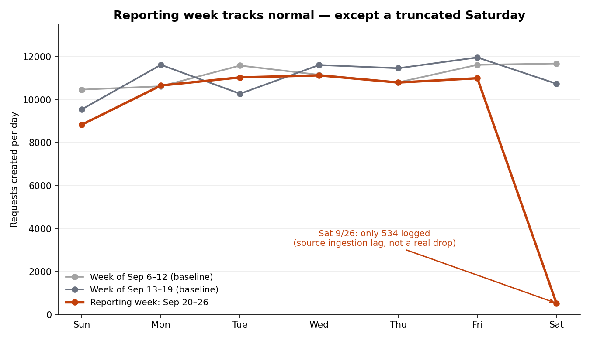
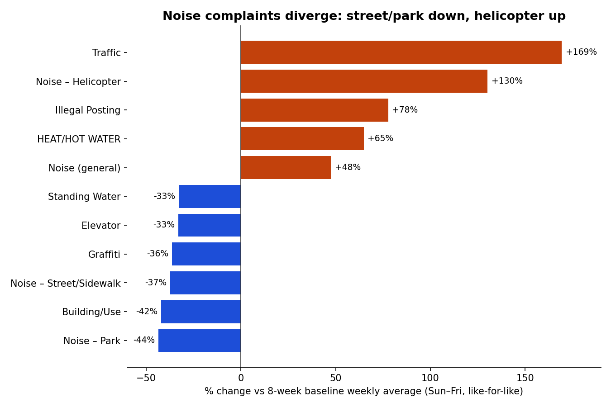
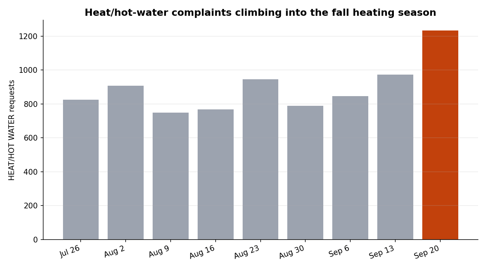

# Executive Summary
Time range covered: 2026-09-20T00:00:00 to 2026-09-27T00:00:00 (America/New_York)
Report generated: 2026-09-27 11:20 Asia/Jerusalem
Total requests analyzed: 63,992

- **Headline volume looks artificially low because of a data-lag gap, not a real drop** — NYC 311 logged 63,992 requests this week, ~14.5% below the 8-week baseline average of ~74,875 (z ≈ -6.2). But the daily breakdown shows Saturday Sept 26 logged only 534 requests versus a typical Saturday count of ~10,140, every one of those 534 records was created between midnight and 2am (zero for hours 3–23), and the latest `created_date` in the *entire* dataset is 2026-09-26T02:06:26 — a hard, global ingestion ceiling, not a citywide activity collapse that happened to land on a Saturday. (Observation / Conclusion)
- **Once the incomplete day is excluded, underlying volume is normal** — the six fully-settled days (Sun–Fri) sum to 63,458 versus a baseline Sun–Fri average of 64,732, a gap of about -2.0% (z ≈ -1.1) — inside the range of ordinary week-to-week fluctuation. Treat the 63,992 total as provisional; it will likely rise as the source backfills. (Conclusion)
- **Street and park noise complaints are genuinely down, not just a truncation artifact** — even comparing like-for-like (six settled days vs. the same six baseline days), "Noise – Street/Sidewalk" is down ~37% and "Noise – Park" down ~44%; a day-by-day check confirms the decline holds on every weekday, not only the missing Saturday. The cause is unconfirmed — cooler late-September weather reducing outdoor and open-window activity is a plausible but unverified hypothesis. (Observation / Hypothesis)
- **Heat/hot-water complaints are climbing into the fall heating season** — up ~65% like-for-like vs. baseline, extending a three-week rise (847 → 973 → 1,233 requests/week) as NYC approaches its October 1 mandatory heat season. (Observation / Hypothesis — seasonal)
- **A small but consistently growing "Traffic" complaint category is worth watching** — weekly counts have risen for three straight weeks (164 → 225 → 297); still under 0.5% of citywide volume, so not yet material, but the trend is directionally consistent rather than a single-week blip. (Observation)
- **No borough-specific anomaly** — the shortfall is proportionally similar across all five boroughs (roughly -10% to -18% each vs. baseline, driven by the same citywide data-lag effect), and each borough's share of total volume is essentially unchanged from baseline (Brooklyn ~32%, Queens ~24%, Manhattan ~20%, Bronx ~19%, Staten Island ~4%). (Observation)

---
# Detailed Findings

1. **Volume: A Headline Drop That's Mostly a Data-Lag Artifact**

   Raw citywide volume this week was 63,992 requests, compared with a trailing 8-week baseline average of 74,875/week (range 72,179–77,937). That is a -14.5% deviation — an extreme move if taken at face value (z ≈ -6.2 against the baseline's own week-to-week spread).

   The daily breakdown explains why:

   | Day | This week | Baseline Sun–Fri/Sat avg (8 wks) | % change |
   |---|---|---|---|
   | Sun 9/20 | 8,839 | 10,290 | -14.1% |
   | Mon 9/21 | 10,659 | 11,242 | -5.2% |
   | Tue 9/22 | 11,036 | 10,798 | +2.2% |
   | Wed 9/23 | 11,130 | 10,718 | +3.8% |
   | Thu 9/24 | 10,797 | 10,628 | +1.6% |
   | Fri 9/25 | 10,997 | 11,056 | -0.5% |
   | **Sat 9/26** | **534** | **10,142** | **-94.7%** |

   (Observation) Every day except Saturday falls within a normal ±5% band of its own day-of-week baseline. Saturday alone is off by nearly 95%. (Observation) An hour-by-hour breakdown of Saturday's 534 records shows they are not spread across the day: 312 were created in hour 0 (12–1am), 210 in hour 1 (1–2am), 12 in hour 2 (2–3am), and **zero** in every hour from 3am to 11pm — and the single latest `created_date` timestamp across the *entire* dataset (every borough, every day) is 2026-09-26T02:06:26, confirming this is a global ingestion ceiling for the whole table, not something specific to Saturday or to any one category/borough. (Conclusion) A day with real, citywide activity does not stop producing 311 requests at 3am and stay at zero for 21 straight hours — this is the signature of the data extract being cut off partway through ingestion, which happens to land on a Saturday this week, not a genuine collapse in demand. Excluding the truncated day, the remaining six days sum to 63,458 vs. a baseline six-day (Sun–Fri) average of 64,732 — a -2.0% gap (z ≈ -1.1), inside the range of ordinary week-to-week fluctuation. **The 63,992 total for this week should be treated as provisional** and will likely revise upward on a future pull.

   

2. **What's Actually Moving: Category Mix, Adjusted for the Missing Day**

   To avoid the Saturday artifact contaminating category-level comparisons (some categories, like weekend-night noise, are naturally concentrated on Fri/Sat and would look artificially crushed), all figures below compare the same six settled days (Sun–Fri) this week against the Sun–Fri average of the same six weekdays across the 8-week baseline.

   | Complaint type | This week (6-day) | Baseline avg (6-day) | % change |
   |---|---|---|---|
   | Traffic | 296 | 110 | +169.4% |
   | Noise – Helicopter | 122 | 53 | +130.2% |
   | Illegal Posting | 148 | 83 | +77.8% |
   | HEAT/HOT WATER | 1,233 | 748 | +64.8% |
   | Noise (general/uncategorized) | 1,424 | 966 | +47.5% |
   | Noise – Park | 113 | 200 | -43.5% |
   | Building/Use | 357 | 617 | -42.1% |
   | Noise – Street/Sidewalk | 2,496 | 3,979 | -37.3% |
   | Graffiti | 218 | 343 | -36.4% |
   | Elevator | 339 | 506 | -33.0% |

   (Observation) "Noise – Street/Sidewalk" and "Noise – Park" are down sharply even in this like-for-like view. Since this category is normally heaviest on Friday/Saturday nights, the initial instinct was that the missing Saturday alone explained its apparent decline — but a day-of-week check rules that out: this week's count is below its own baseline average on **every single weekday** (Sun -49%, Mon -33%, Tue -24%, Wed -24%, Thu -20%, Fri -40%), not just on the truncated Saturday. (Hypothesis) A plausible, unverified explanation is a seasonal transition — cooler late-September evenings mean fewer open windows and less outdoor/street activity late at night — but this report has no temperature data to confirm mechanism; treat as a hypothesis, not a conclusion. "Building/Use" and "Elevator" (both inspection-adjacent categories tied to HPD/DOB) are down by a similar magnitude and may share a common driver (e.g., inspector scheduling or backlog effects), but this is speculative and not verified here.

   (Observation) HEAT/HOT WATER is up ~65% like-for-like and continues a three-week upward run (847 → 973 → 1,233 requests/week over the last three baseline+current weeks). (Hypothesis) This is consistent with seasonal cooling ahead of NYC's October 1 mandatory heat season, though again no weather data was pulled to confirm the mechanism directly — the pattern (multi-week, monotonic, calendar-aligned) is more consistent with seasonality than a one-off event.

   (Observation) Traffic, Noise–Helicopter, and Illegal Posting show the largest percentage jumps, but all three are small-base categories (110–150 requests/week at baseline) where percentage swings are naturally more volatile — treat single-week percentage changes here cautiously. Traffic is the one exception worth flagging on its own: it has risen for three consecutive weeks (164 → 225 → 297), a directionally consistent trend rather than a single-week spike, even though it remains under 0.5% of citywide volume.

   

   

## Geography

(Observation) Borough shares of citywide volume are essentially unchanged from baseline, and every borough shows a similar-magnitude shortfall vs. its own baseline — consistent with the citywide data-lag effect from Finding 1 rather than any borough-specific issue.

| Borough | This week | Baseline avg (8 wks) | % change | Share this week | Share baseline |
|---|---|---|---|---|---|
| Brooklyn | 20,597 | 23,866 | -13.7% | 32.2% | 31.9% |
| Queens | 15,670 | 19,017 | -17.6% | 24.5% | 25.4% |
| Manhattan | 13,084 | 14,499 | -9.8% | 20.5% | 19.4% |
| Bronx | 12,083 | 14,428 | -16.3% | 18.9% | 19.3% |
| Staten Island | 2,471 | 2,980 | -17.1% | 3.9% | 4.0% |
| Unspecified | 87 | 86 | +1.0% | 0.1% | 0.1% |

Shifts in share are all under 1.1 percentage points — not material. 87 requests (0.14%) this week lack a borough value, in line with baseline (0.12%).

## Caveats & Data Quality

- **Primary caveat — incomplete last day:** Saturday Sept 26 is severely under-represented (534 of an expected ~10,142 requests) due to source ingestion lag at the time of this pull. This depresses the headline total and inflates the apparent decline of any Friday/Saturday-night-heavy category. All volume and category comparisons in this report use a six-day (Sun–Fri) like-for-like adjustment specifically to work around this — but the official 63,992 total (which includes the truncated Saturday) is the number quoted in the Executive Summary as required, and should not be read as a settled final figure for the week.
- **Right-censoring near the window edge:** independent of the ingestion-lag issue above, requests created in the last 1-2 days of any week are mechanically less likely to show status "Closed" yet. This week, 35.7% of requests are Open/In Progress vs. an 8-week baseline share of ~10.2% Open+In Progress — a gap larger than right-censoring alone would typically produce, and directionally consistent with the same late-week data-lag pattern (Saturday's few logged records are disproportionately unresolved, and this week overall skews toward more recently-created, still-open cases). This is presented as a data-quality note rather than an operational backlog claim.
- **Long-tail categories excluded from ranked comparisons:** complaint-type comparisons above use the top 100 categories by volume per query (a $limit=100 cap); this captures over 99% of records each week, but the very long tail (100+ additional rarely-used categories) is not individually reflected in the mover tables.
- **Retroactive backfill / revision risk:** Socrata's 311 dataset is known to receive corrections and backfilled records after initial publication; figures in this report, especially this week's total, may shift slightly if re-pulled later.
- **Geocoding gaps:** 0.14% of this week's requests lack a borough value (in line with baseline); this is immaterial to the geographic breakdown above but is noted for transparency.
- Validation: rigor-pass run (fixes addressed — corrected two z-score arithmetic errors from -6.3/-0.6 to -6.2/-1.1, and added the hour-of-day evidence strengthening the data-lag claim from hypothesis to conclusion); independent verification of "the volume shortfall is a data-lag artifact affecting Saturday specifically, not a real demand drop" → HOLDS WITH CAVEAT (magnitude and direction both confirmed independently; the caveat is that the cutoff is a dataset-wide ingestion ceiling that happens to land on a Saturday this week, not a mechanism unique to Saturday — reflected in the wording above).

## Data & Methodology

- Source: NYC 311 Service Requests (Socrata SODA API), endpoint `https://data.cityofnewyork.us/resource/erm2-nwe9.json`, queried via `curl`/Python `urllib` with `$select`/`$where`/`$group` aggregate queries (no raw-row pulls).
- Reporting week window: `created_date >= '2026-09-20T00:00:00' AND created_date < '2026-09-27T00:00:00'` → 63,992 total (matches the independently-provided figure).
- Baseline: 8 trailing weeks strictly before the reporting week, 2026-07-26T00:00:00 through 2026-09-20T00:00:00, queried both as 8 discrete weekly windows and, for methodology transparency, sometimes as one combined range — the reporting week itself is never included in any baseline figure.
- Weekly baseline totals (oldest → most recent): 74,208 / 73,720 / 74,649 / 74,416 / 74,661 / 72,179 / 77,937 / 77,229 → mean 74,875, weekly-total std. dev. ≈ 1,742.
- Six-day (Sun–Fri) baseline totals for the same 8 weeks, from daily counts summed per week: 64,219 / 63,782 / 65,035 / 64,369 / 64,838 / 62,874 / 66,255 / 66,487 → mean 64,732, std. dev. ≈ 1,132 (this is the mean/std used for the -2.0%, z≈-1.1 comparison quoted above). A separate, category-level 6-day baseline sum built from capped ($limit=100) complaint_type queries comes in slightly lower (mean 64,170) purely because the long tail beyond the top 100 categories per week is dropped from that aggregation — immaterial here since the same cap is applied symmetrically to both the reporting week and baseline in the category table (Finding 2).
- Daily counts: `$select=date_trunc_ymd(created_date) as day, count(*) as cnt` grouped by day, for the reporting week and for the two immediately prior weeks (used for the daily-volume chart) and the full 8-week baseline range (used for day-of-week averages).
- Hour-of-day check for Saturday 9/26: `$select=date_extract_hh(created_date) as hr, count(*) as cnt`, `$where=created_date >= '2026-09-26T00:00:00' AND created_date < '2026-09-27T00:00:00'`, `$group=hr` → 312 (hr 0), 210 (hr 1), 12 (hr 2), 0 for all of hr 3–23. Independent verification separately confirmed `max(created_date)` across the whole dataset is 2026-09-26T02:06:26.
- Category breakdowns: `$select=complaint_type, count(*) as cnt` grouped by `complaint_type`, `$limit=100`, `$order=cnt DESC`, run once for the reporting week's Sun–Fri range and once per baseline week's aligned Sun–Fri range, then summed/averaged in Python.
- Borough, agency, status, and channel-type breakdowns: same `$group` pattern on `borough`, `agency_name`, `status`, and `open_data_channel_type` respectively, for the reporting week and the full 8-week baseline range.
- Charts rendered with Python/matplotlib (Agg backend) from the aggregates above; saved to `output/charts/` with filename prefix `26_09_20`.