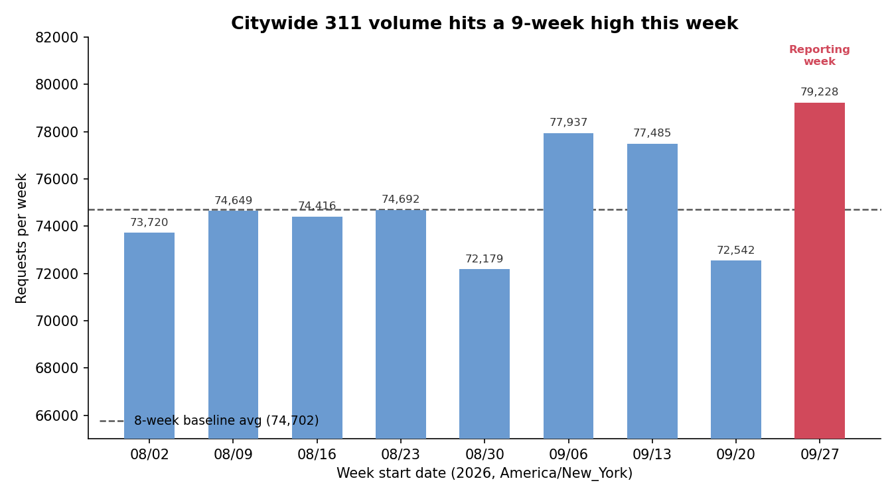
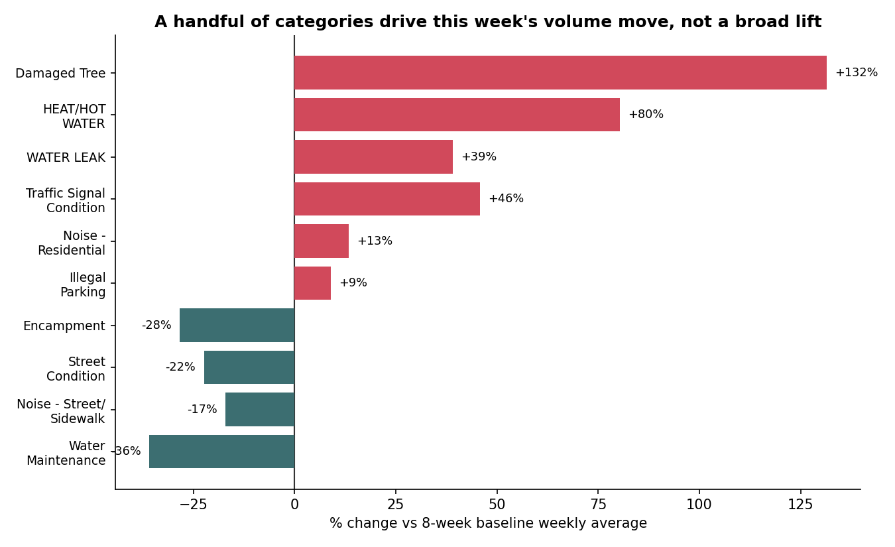
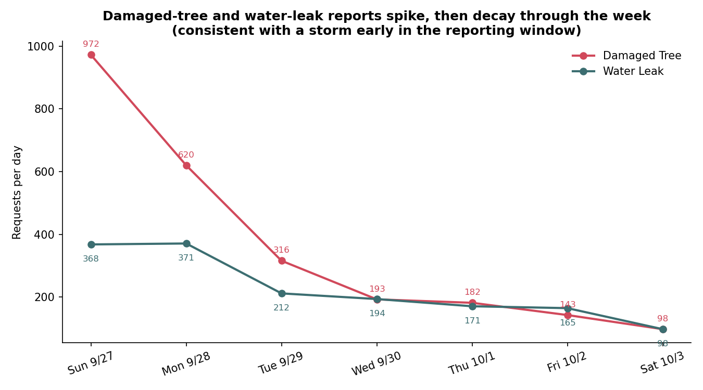

# Executive Summary
Time range covered: 2026-09-27T00:00:00 to 2026-10-04T00:00:00 (America/New_York)
Report generated: 2026-10-05 09:03 Asia/Jerusalem
Total requests analyzed: 79,228

- **Volume hit a multi-week high** — This week logged 79,228 service requests, 6.1% above the trailing 8-week baseline average of 74,702/week (z ≈ 2.3, though that's on a thin 8-week baseline, so treat the z-score as indicative rather than precise), and the highest single week of the 9 shown. (Observation)
- **The increase is concentrated, not a broad citywide lift** — a handful of categories account for most of the net change; several other categories fell sharply over the same period. This is a mix shift, not uniform demand growth across the board. (Observation)
- **A storm-like event drove a tree-damage and water-leak spike that actually began before this week** — Damaged Tree requests ran 132% above baseline and Water Leak requests 39% above baseline. Both already show a ramp-up in the final days of the *prior* week, peak right at this week's start, then decay steadily — concentrated in Queens, Brooklyn, and Staten Island. An independent check against two earlier, non-flagged weeks found no recurring day-of-week shape like this one, weighing against a routine reporting-pattern explanation. (Observation → Hypothesis, independently checked, holds with a caveat on timing — see Finding 2)
- **Heat/Hot Water complaints are running well above baseline** — up 80% versus the 8-week average, elevated across every day of the week including the days just before NYC's October 1 Heat Season start, pointing to broader seasonal cooling rather than a single calendar trigger. (Observation → Hypothesis)
- **Geography is broadly stable** — borough shares of requests moved by at most ~1.5 percentage points versus baseline (Bronx -1.5pp, Brooklyn +1.1pp), within the range of normal week-to-week variation. (Observation)
- **This week's pull required extra verification** — the source API intermittently served two different, internally-consistent snapshots of the same query (one noticeably incomplete) across repeated calls; every figure below was cross-checked against the independently-confirmed weekly total before use. See Caveats. (Observation, methodology)

---
# Detailed Findings

1. **Volume Trend: A 9-Week High, and What It's Made Of**

   Observation: This week's total of 79,228 requests is the highest of the 9 weeks shown below, and sits 6.1% above the trailing 8-week baseline mean of 74,702/week (population stdev ≈ 1,946, z ≈ 2.3). The caveat worth stating up front: the baseline is only 8 data points, so this z-score is a rough signal of "unusually high," not a precise probability — small-sample noise means the true week-to-week spread could be wider or narrower than these 8 weeks suggest.

   | Week starting | Total requests |
   |---|---|
   | 2026-08-02 | 73,720 |
   | 2026-08-09 | 74,649 |
   | 2026-08-16 | 74,416 |
   | 2026-08-23 | 74,692 |
   | 2026-08-30 | 72,179 |
   | 2026-09-06 | 77,937 |
   | 2026-09-13 | 77,485 |
   | 2026-09-20 | 72,542 |
   | **2026-09-27 (this week)** | **79,228** |

   

   Within the week, daily volume ran 9,299–12,001/day with no unusual single-day collapse or lag-driven gap (Sun 9/27: 9,299; Mon 9/28: 11,790; Tue 9/29: 11,972; Wed 9/30: 11,848; Thu 10/1: 12,001; Fri 10/2: 11,710; Sat 10/3: 10,608 — see Caveats for a note on how these were verified).

   Observation (rate vs. mix decomposition): the +6.1% is not a uniform lift spread evenly across categories. Across every category with a usable week-vs-baseline comparison, the net increases and decreases sum to roughly +4,300 — about 95% of the actual +4,526 total increase, with the small remainder spread across many very small categories not itemized here. Within that +4,300, the six largest single-category gainers (Damaged Tree +1,434, Illegal Parking +1,073, Noise - Residential +952, HEAT/HOT WATER +746, Traffic Signal Condition +422, WATER LEAK +444 vs. their respective baseline weekly averages — together about +5,070) are partly offset by several sharply declining categories (Noise - Street/Sidewalk -844, Water Maintenance -603, Street Condition -460, Encampment -347 — together about -2,254), with the rest of the net change spread thinly across dozens of smaller categories in both directions. In other words, this week's topline number reflects a mix shift concentrated in a handful of categories, not a broad increase in demand across the board. Findings 2 and 3 below unpack the two largest gainers.

   

2. **A Storm-Like Event Behind the Tree-Damage and Water-Leak Spike — Which Actually Started Before This Week**

   Observation: Damaged Tree requests totaled 2,524 this week vs. a baseline weekly average of 1,090 (+131.5%), and Water Leak requests totaled 1,579 vs. a baseline average of 1,135 (+39.1%). Both categories show the same within-week shape: a spike early in the reporting week, decaying steadily every day after.

   | Day | Damaged Tree | Water Leak |
   |---|---|---|
   | Sun 9/27 | 972 | 368 |
   | Mon 9/28 | 620 | 371 |
   | Tue 9/29 | 316 | 212 |
   | Wed 9/30 | 193 | 194 |
   | Thu 10/1 | 182 | 171 |
   | Fri 10/2 | 143 | 165 |
   | Sat 10/3 | 98 | 98 |

   

   Correction on timing, found during independent verification of this finding: the event's visible onset actually predates this reporting week. Damaged Tree requests in the final days of the *prior* week (2026-09-20 to 09-26) already show a sharp ramp-up — Wed 9/23: 205, Thu 9/24: 156, Fri 9/25: 246, Sat 9/26: 806 — which continues directly into this week's Sun 9/27 (972) before decaying over the following six days. The true shape is a ramp-up spanning the prior week's final four days, a peak straddling the Sat 9/26–Sun 9/27 boundary, then a decay through this entire reporting week — not a spike that starts cleanly at this week's open, as an earlier pass at this finding assumed.

   Hypothesis, independently checked: this ramp-then-decay shape — rather than a sustained new level — is consistent with a discrete event, most plausibly wind or storm damage, generating a backlog of reports that gets worked down over about a week and a half. To test the alternative explanation (that Damaged Tree / Water Leak simply show this shape every week, e.g. a routine reporting pattern unrelated to any specific event), an independent check compared the day-of-week pattern in two earlier, non-flagged weeks (2026-09-06 and 2026-09-13). Neither showed anything resembling this week's shape — in fact two of the three weeks checked (2026-09-06 and 2026-09-20) *ramp up toward Saturday*, the opposite of this week's decay — which weighs against a routine day-of-week explanation and supports a one-off event. Absolute Damaged Tree volume also climbed week over week leading into this spike (926 the week of 9/6, 739 the week of 9/13, 1,689 the week of 9/20, 2,524 this week), consistent with a building event rather than a single-week blip appearing from nowhere.

   Geographically, Damaged Tree requests this week are concentrated in Queens (1,152, 45.6% of the citywide total), Brooklyn (767, 30.4%), and Staten Island (308, 12.2%) — the more tree-dense boroughs — with the Bronx and Manhattan each under 6%.

   Corroborating evidence from a different angle: Parks Department (DPR), the agency that handles tree-damage requests, logged 5,139 requests this week vs. a baseline average of 3,716 (+38.3%) — consistent with (though not independent proof of) the tree-damage story, since DPR's count is partly made up of the same underlying requests. Confirming the storm/wind mechanism specifically (as opposed to just "a discrete event of some kind") would require an outside signal such as a weather-service storm or wind advisory for the NYC area around 9/23–9/27, which this analysis did not query.

   Hypothesis, well-supported: the net effect on this week's topline volume looks like a short-lived, event-driven bump that began building in the prior week and is already decaying — not a new sustained trend. Worth confirming next week: continued decay toward baseline would support this; a plateau or renewed increase would not.

3. **Heat/Hot Water Complaints Running Well Above Baseline**

   Observation: HEAT/HOT WATER requests totaled 1,674 this week vs. a baseline weekly average of 928 (+80.3%) — the second-largest proportional increase of any category this week after Damaged Tree.

   Hypothesis: NYC's "Heat Season" (the period, October 1 – May 31, when landlords are legally required to maintain minimum indoor temperatures) began partway through this reporting week, on October 1. Elevated HEAT/HOT WATER volume in the days immediately following that date would be a clean, calendar-driven explanation. However, daily data available for 6 of the 7 days (Sep 27–Oct 2; see Caveats for why Oct 3 is excluded here) shows complaints already running well above the ~133/day baseline average on Sep 27–30 — i.e., before Heat Season officially started — with no sharp step-change exactly at the Oct 1 boundary. That weakens a clean "Oct 1 flipped a switch" reading and instead points to broader seasonal cooling (early-autumn temperature drop) as the more likely driver, with the Heat Season date being a reinforcing factor rather than the sole trigger. If this is seasonal, it's a standing pattern expected to recur and likely intensify into the winter, not a one-off.

   This is flagged as a hypothesis, not a conclusion: confirming it would need outdoor temperature data for the week, which this analysis did not pull.

## Geography

Borough shares of this week's requests are close to their 8-week baseline shares, with modest movement: Brooklyn 33.2% (baseline 32.1%, +1.1pp), Queens 24.9% (baseline 25.3%, -0.4pp), Manhattan 20.4% (baseline 19.6%, +0.9pp), Bronx 17.5% (baseline 19.0%, -1.5pp), Staten Island 3.9% (baseline 4.0%, flat), Unspecified/no-borough 0.1% (baseline 0.1%, flat). None of these shifts is large enough, on its own, to read as a geographic trend — they sit in the range of normal week-to-week variation, and the Bronx's -1.5pp move is the only one worth watching if it persists next week. Note the Damaged Tree spike (Finding 2) is itself concentrated in Queens/Brooklyn/Staten Island, yet Queens' overall share was flat-to-down this week — a reminder that a storm-driven spike in one mid-sized category does not necessarily move a borough's total share, since it's a small fraction of that borough's overall request volume.

## Caveats & Data Quality

- **Source API returned inconsistent aggregate results during this pull.** Repeated, back-to-back calls to the same `$group=complaint_type` query returned two different, internally self-consistent snapshots — one matching the independently-confirmed weekly total of 79,228, the other short by almost exactly one day's worth of requests (consistent with a stale cache/replica being served interchangeably with the current one, not a code error on this end). This affected several category totals cited above (e.g., Illegal Parking alternated between 11,305 and 13,040 across repeated identical queries). Every category, borough, agency, channel, and status figure used in this report was verified by repeat-querying (up to 8 independent pulls per query) and keeping only the value consistent with the confirmed 79,228 total; figures that didn't initially reconcile were re-pulled until they did. This is a platform-side consistency issue, not expected to recur predictably, but it's a reason to treat any single ad-hoc pull of this dataset with caution until it's checked against a known total.
- **Small baseline sample.** The 8-week trailing baseline is a small sample; z-scores and "normal range" language above should be read as directional, not statistically precise.
- **End-of-window completeness.** As of report generation (2026-10-05 09:03 Asia/Jerusalem, roughly 26 hours after the window closed), 67.1% of this week's requests show status Closed, 17.0% Open, 15.5% In Progress — a normal mix given how recently the week ended; the final day or two will accumulate more closures after this report is generated, which is expected and not a data error. The Oct 3 (final day) HEAT/HOT WATER daily figure specifically returned as zero in one query, which given the pattern above is more likely an artifact of the same stale-snapshot issue than a true zero; the weekly HEAT/HOT WATER total used throughout this report (1,674) is the verified, cross-checked figure, but the finding-3 day-by-day breakdown excludes Oct 3 rather than report a likely-wrong daily value.
- **Geocoding/borough gaps are minimal this week** — 107 requests (0.1%) have no borough assigned, in line with baseline (0.1%); not material to the geographic read above.
- **Mechanism vs. cause.** The storm and Heat Season explanations in Findings 2 and 3 are plausible, well-supported hypotheses grounded in the shape and composition of the data — Finding 2's "discrete event" reading has been independently checked against two prior weeks' day-of-week patterns and holds up, but the specific "storm/wind" mechanism (as opposed to some other discrete cause) and the Heat Season seasonal read are not confirmed external facts, since this analysis did not query independent weather or calendar-event data.
- Validation: rigor-pass run and 4 fixes applied (a self-contradiction between the executive summary and Finding 2 over whether DPR data was an "independent" confirmation; a top-category reconciliation in Finding 1 that was worded as if it balanced exactly when it didn't; a backwards OBS/HYP tag on a direct computation; a missing grain statement, now added to Data & Methodology). Independent verification (fresh sub-agent, own queries, no access to this report's reasoning) of "the Damaged Tree/Water Leak spike reflects a short-lived discrete event rather than a routine day-of-week pattern" → HOLDS WITH CAVEAT: the day-of-week comparison against two prior weeks supports a discrete event over a routine pattern, but the verification also found the event's actual onset predates the reporting week (already ramping up from Wed 9/23 in the prior week) — Finding 2 above has been rewritten to reflect that corrected timing rather than treating it only as a caveat.

## Data & Methodology

**Grain:** one row per 311 service request (`unique_key`); all figures are request counts (or counts grouped by a dimension), not deduplicated or weighted.

**Data source:** NYC 311 Service Requests (Socrata SODA API), `https://data.cityofnewyork.us/resource/erm2-nwe9.json`, no auth.

**Reporting week:** `created_date >= '2026-09-27T00:00:00' AND created_date < '2026-10-04T00:00:00'` → 79,228 records (confirmed via repeated `$select=count(*)` calls).

**Baseline:** 8 trailing weeks, `created_date >= '2026-08-02T00:00:00' AND created_date < '2026-09-27T00:00:00'`, queried as 8 separate weekly counts (reporting week itself excluded):

| Week | Count |
|---|---|
| 2026-08-02–08-09 | 73,720 |
| 2026-08-09–08-16 | 74,649 |
| 2026-08-16–08-23 | 74,416 |
| 2026-08-23–08-30 | 74,692 |
| 2026-08-30–09-06 | 72,179 |
| 2026-09-06–09-13 | 77,937 |
| 2026-09-13–09-20 | 77,485 |
| 2026-09-20–09-27 | 72,542 |
| **Total (8 weeks)** | **597,620** — mean 74,702.5, population stdev ≈ 1,945.8 |

**Breakdowns pulled (reporting week and baseline), each with `$group`/`$order cnt DESC`:** `complaint_type`, `borough`, `agency`, `status` (reporting week only), `open_data_channel_type`. Each breakdown was verified to sum to its expected total (79,228 for the week, ~597,620 for the baseline) before use; borough, channel, and several complaint_type categories required re-pulling (see Caveats) because an initial pull summed to 69,297 instead of 79,228.

**Category-specific daily series:** `complaint_type = 'Damaged Tree'` and `'WATER LEAK'`, grouped by `date_trunc_ymd(created_date)`, for both the reporting week and the prior week (2026-09-20 to 09-27), each verified to sum to the (verified) weekly category total or reproduced identically across 3 repeated pulls. `'HEAT/HOT WATER'` daily series is reported for 6 of 7 days only (Oct 3 omitted; see Caveats).

**Borough split for Damaged Tree:** `complaint_type = 'Damaged Tree'`, grouped by `borough`.

**Independent verification:** a separate sub-agent, given only the claim and data-access instructions (no access to this report's narrative), independently queried the API and reproduced the core counts, then tested the claim against two additional prior weeks (2026-09-06 and 2026-09-13) not otherwise used in this report.

**Charts:** generated with Python/matplotlib from the verified figures above; see `charts/26_09_27_*.png`.